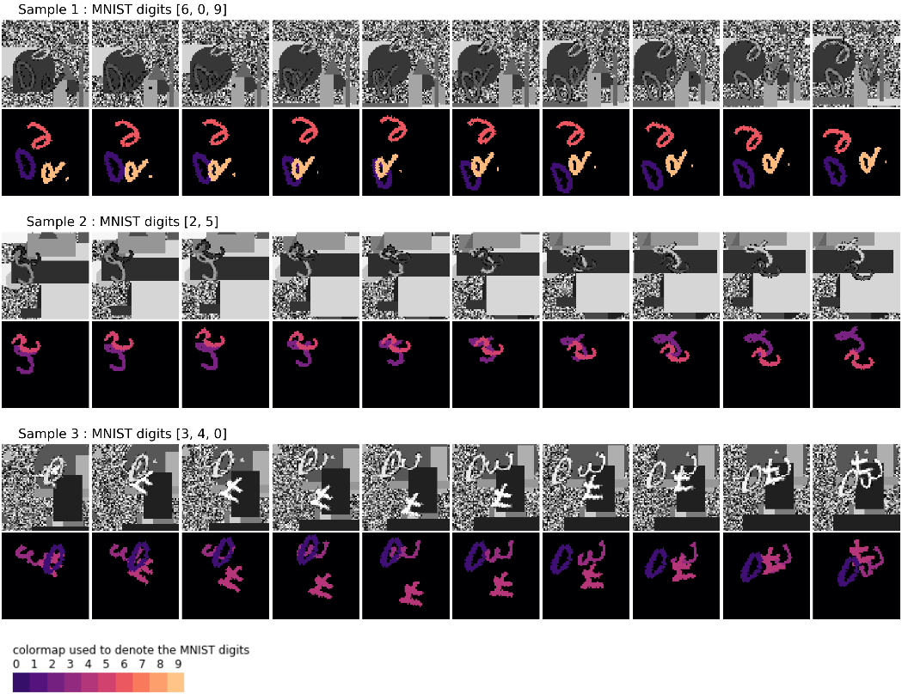

# segmentation-moving-MNIST
The moving-MNIST video dataset reformulated for the task of semantic segmentation.

The moving-MNIST dataset orginially described in Srivatsava et al.[[1]](#1) is extended for the
task of semantic segmentation. 

Sample videos and the respective segmentation labels from the dataset:

The videos consist of hand-written MNIST digits that move around the frame and bounce back when they encounter the walls of the frame. It is an 11-class semantic segmentation challenge with one class for each of the 10 digits and an additional class for the background (as shown by the color-coded segmentation labels and the legend in above Figure). 

The dataset consists of the MNIST hand-written digits moving around in a frame with a noisy background and occluding each others. The background is depicted in black in the labels and the color coding used for each digit is shown in the bottom-left legend. The dataset is created such that the task of segmenting the digits from the background and identifying its correct class becomes a non-trivial problem. Firstly, the background is formed of non-static pepper noise that can change between consecutive frames. Secondly, the background can contain multiple overlapping geometric shapes of different sizes and brightness that move around in the video (can be observed in samples 2 and 3 in Figure 6.1). Each video can consist of two to three digits moving around the frame at different velocities, with slowly varying brightness, rotating at different rates, and can even occlude each other (observe sample 3). It should also be noted that it is unlikely for any model to reach a 100% accuracy as there exist various conditions in the dataset that are
ambiguous and indeterminable. For instance, in samples 1 and 2 in the figure, one can notice that the digits 6 and 9 or 2 and 5 are difficult to differentiate even to humans since they rotate in the video and constantly occlude each other. A similar ambiguous situation occurs when digits and background shapes having the same brightness occlude each other and cannot be differentiated from one
another. In the future, these conditions in the synthetic dataset could pave way for the development and testing of models that could handle such ambiguity which also exist in real-world scenarios.

## References
<a id="1">[1]</a> 
N. Srivastava, E. Mansimov, and R. Salakhutdinov (2015). 
“Unsupervised Learning of Video Representations using LSTMs”. 
In: CoRR abs/1502.04681. 
arXiv: 1502.04681. 
url: http://arxiv.org/abs/1502.04681.  
